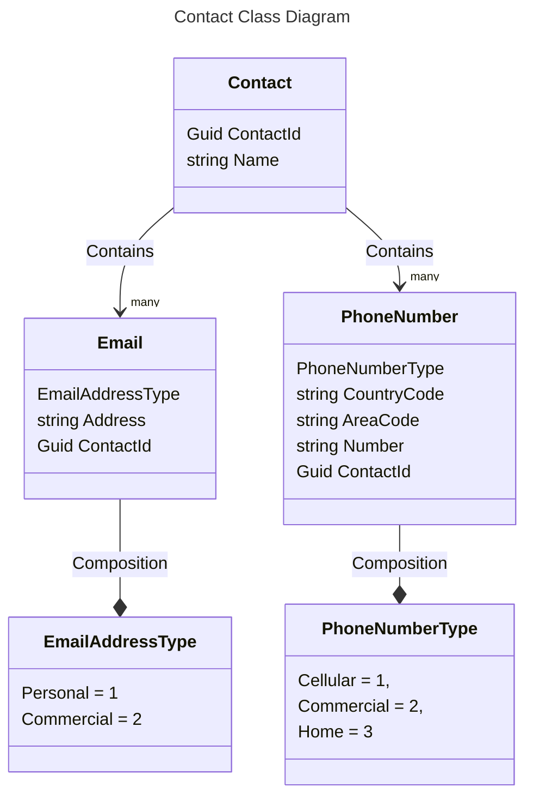
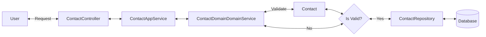

# Arquitetura de Sistemas .Net com Azure

## Projeto destinado aos tech challenges da pós tech FIAP

Cada Tech Challenge é uma solução a parte com sua própria documentação.

## Branchs
- master: branch produtiva
- develop: branch de desenvolvimento

## Padrão de commits
**tipo(titulo):descrição**

o título é opcional.

### Tipos
- chore: alteração na documentação
- fix: correções de bugs
- feature: novas funcionalidades

## Banco de dados
### Padrão de nomenclaturas

- Nomes das tabelas no singular
- Nomes das colunas no singular
- Nomes em inglês
- Pascal casing (ex: UserRole)
- O id de cada tabela deve ser o nome da tabela seguido de Id (ex: UserRoleId)
- Para fazer a migração executar o comando Add-Migration NomeDaMigracao -OutputDir Infrastructure/Migrations ( NomeDaMigracao seguir o padrão AddTbl_Descrição, DelTbl_Descrição, AddFields_Descrição ....)
- A migração é executada automaticamente não é necessário executar o comando Update-Database.

## Classes Diagrams

## Request flow

